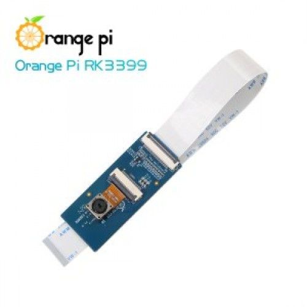

# OV13850_OrangePi_Clone

</b>

  13 Million pixels Camera OV13850 with MIPI interface only compatible with Orange Pi RK3399,
According to he note on the schematic,this Camera is to be connected to 10.1inch Screen for RK3399, not the SBC board.

MIPI transmission is terminated at 100R differential, could be either a microstrip or coplanar differential. The latter is preffered.

## <b>NOTE</b>
we are using kicad 9.0.0.RC3 , which is a nightly build.
